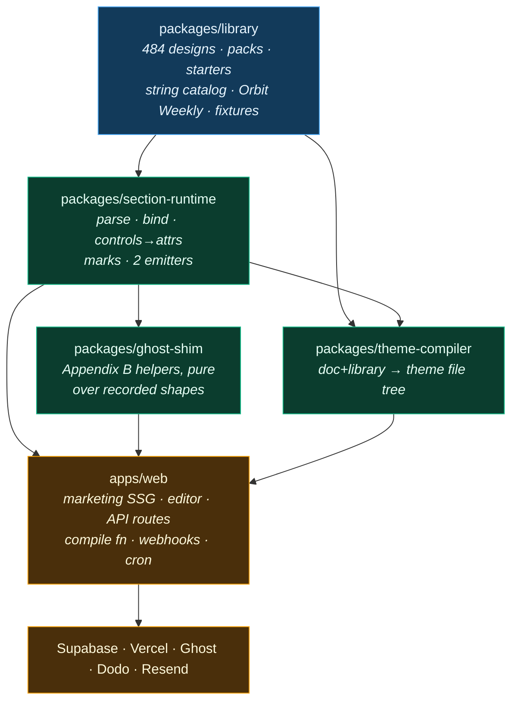
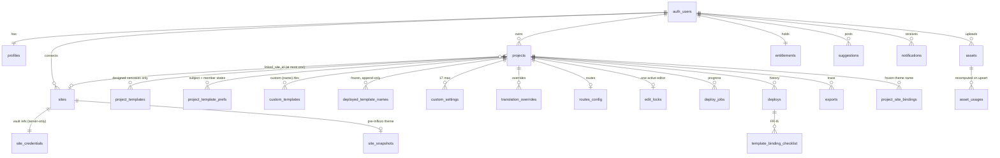
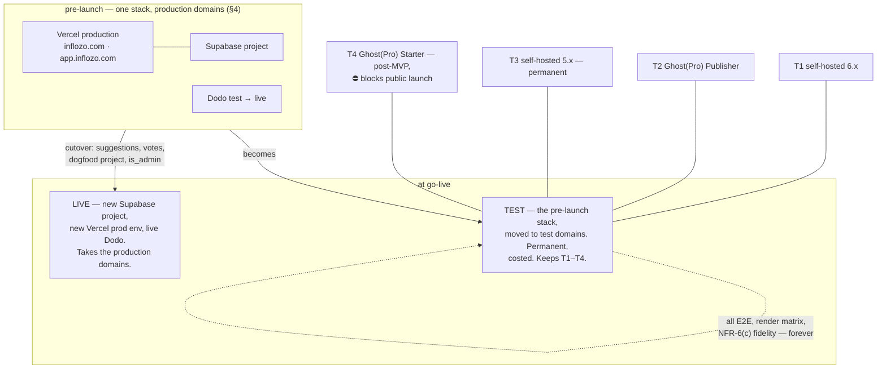

# Architecture Spine — Inflozo

## Design Paradigm

**Functional core / imperative shell, with the core shared verbatim between the browser and the server.**

The core is a pure, deterministic pipeline: annotated HTML + a project doc go in, and two
emitters come out — canvas DOM and `.hbs` text. It performs no I/O, holds no clock, and
imports nothing from Next.js, Supabase or Node. That is not a style preference; it is the
only structure in which §7.3's central claim — canvas and shipped output agree *by
construction* — can be true, because "the same code ran" is the proof and anything the core
reaches for at runtime is a second source of truth.

Everything else is shell: the Next.js app, the Vercel functions, Supabase, Ghost's two APIs,
Dodo, Resend. The shell fetches, validates, persists and uploads; it hands the core plain
values and takes plain values back.

| Layer | Lives in | May depend on |
| --- | --- | --- |
| Library (data) | `packages/library` | nothing |
| Core (pure) | `packages/section-runtime`, `packages/ghost-shim`, `packages/theme-compiler` | library, each other |
| Shell (I/O) | `apps/web` (routes, server actions, functions, middleware) | core, library, platform SDKs |
| Platform | Supabase, Vercel, Ghost, Dodo, Resend | — |



Arrows are the whole dependency rule: they point one way and there is no arrow back into the
core. A design that needs the shell has been designed wrong.

## Invariants & Rules

### AD-1 — The core is pure and is the same code on both sides

- **Binds:** E4, E5, E7, E9–E11, E14 · FR-D4, FR-G3, FR-H5, FR-J1, NFR-6(c1)(c2)
- **Prevents:** the canvas and the compiler drifting into two implementations of one thing — the failure §7.3 exists to make impossible, and the one a React preview component would reintroduce.
- **Rule:** nothing under `packages/section-runtime`, `packages/ghost-shim` or `packages/theme-compiler` may import `next/*`, `@supabase/*`, `node:fs`, `node:net`, `process.env`, `fetch`, `Date.now`, `Math.random`, or a DOM global it did not receive as an argument. **The ban also covers four things that read the machine rather than the arguments** — `localeCompare`, `toLocaleUpperCase` / `toLocaleLowerCase`, anything under `Intl.*`, and `.toString()` / `.getHours()` on a `Date` — because each silently substitutes host locale or timezone for an input and would void AD-14 the first time anyone sorted a list of design ids. Nothing uses them today: the compile is byte-identical across four LANG/TZ combinations including `tr_TR.UTF-8` and `Pacific/Kiritimati` (Round 2, executed). They are banned because they are the natural reach when sorting or formatting, not because they are present. The DOM implementation is injected (`window.document` in the browser, a `jsdom` document in the function). Enforced by a CI dependency boundary check, not by review.

### AD-2 — The section library is data, never code

- **Binds:** E4, E9, E10, E11, E14 · FR-G3, FR-G7, P4
- **Prevents:** a design authored as a module, which would break both "a section file opens directly in a browser during authoring" and the two-renderer guarantee at once.
- **Rule:** a design is four files plus two schemas under `packages/library/designs/{category}/{id}/` — `index.html` (annotated), `style.css` (flat, `var(--…)` only), optional `behaviour.js`, `design.json` (`controlSchema`, `quickControls[]`, `bindingContext`, `compileTarget`, `ghostCompat`, `darkCapabilities`, `previewSeed`, `tier`, structural descriptor tuple) — plus one `content.json` per **category** (the union content model). Nothing imports a design; both renderers read it. Removing the directory removes the design, its stylesheet and its module together. **The string catalog sits under the same contract:** keys are `{category}.{name}` dotted and namespaced per category so ~34 independent category stories cannot collide, they are **append-only and never reworded in place**, and a superseded key ships an FR-J14 migration map in the same release that supersedes it — otherwise a later category story silently orphans every user override keyed on the old string.

### AD-3 — A control is one attribute on the section root, and a design switch replaces the set

- **Binds:** E4, E5, E6, E7, E9–E11 · FR-F1–F7, FR-D19, FR-E4, FR-Q3, §7.3
- **Prevents:** four epics inventing four ways to make a control visible — inline styles here, a generated class there, a CSS-in-JS variant in the third.
- **Rule:** every control value writes `data-{control}="{named-value}"` on the section root and the design's stylesheet selects on it. **One carve-out, and it is the only one** *(Round 3 decision B)*: an inline `style` attribute may set a **CSS custom property from bound Ghost data, and nothing else** — `style="--tag-accent: {{accent_color}}"` is legal, `style="color: red"` is not. It exists because A20 tints each tag with the colour its owner set in Ghost, a value unknowable when the stylesheet is authored. The design stylesheet still performs all styling; it only reads the variable. **The alternative was worse:** emitting one rule per tag at compile time keeps the ban intact but goes stale the moment the owner adds a tag, rendering it unstyled until the next deploy — a design that silently rots is a worse defect than the rule protects against. The boundary is machine-checkable, so the FR-J17 gate asserts it: any inline `style` whose content is not a single `--custom-property` assignment fails the build. Switching design **removes** every attribute the incoming design does not declare (its value parks per FR-D19) and adds the incoming design's defaults. No inline styles, no generated class names, no CSS-in-JS, no per-section width. A promoted control emits `data-{control}="{{@custom.key}}"` with **no change to the stylesheet**.

### AD-4 — User text is text-plus-marks, and becomes markup at exactly one place

- **Binds:** E0(a), E4, E5, E7 · FR-D4, FR-J1, FR-Q3, NFR-3
- **Prevents:** two escaping implementations, and the class of bug where an HTML string round-trips through a parser nobody audited.
- **Rule:** a text prop is `{ text: string, marks: [{start, end, mark, href?}] }` over exactly `strong | em | u | a`. `packages/section-runtime/marks.ts` is the single serializer and both renderers call it. Paste normalizes to the same four marks on entry. FR-Q3's plain-text lock truncates `marks` to `[]`; it never parses. The compiler never emits `{{{ }}}` — there is no user HTML to emit.
- **Rule (the half that reads backwards, and is the one that matters):** both renderers call the same serializer, but **only the canvas puts its output into a DOM.** The theme renderer splices the serialized fragment into the emitted string *after* `outerHTML` has run — no document ever parses it. The natural reading of "both renderers call `marks.ts`" is the broken one: AD-5's numeric entities do not survive a DOM round trip, because the HTML parser decodes `&#123;` back to `{` on `innerHTML` and the serializer never re-escapes a brace. Executed in Round 2 — `&#123;&#123;<strong>title</strong>&#125;&#125;` set as `innerHTML` serializes back out as a **live** `{{`. Decoding is correct on the canvas (the user must see their own literal text) and fatal in the theme. With the splice, all eight brace-and-mark compositions ship inert: a mark boundary inside a brace run, a boundary between the two `{` of `{{`, an `href` containing braces, nested marks over `{{#if x}}…{{/if}}`, the FR-Q3 lock, pasted HTML carrying both, a user URL with braces and a quote, and a user typing the substitution marker itself.

### AD-5 — Brace-safe emission [supersedes §7.3's stated escaping remedy]

- **Binds:** E0(a), E4, E7 · FR-D4, FR-J1, FR-Q5, §7.3
- **Prevents:** two live defects proved by execution against Handlebars 4.7.9 (see `MEASUREMENTS.md`) — user text evaluating as a template, and a theme that will not compile.
- **Rule (two parts):**
  1. **User text escapes by HTML numeric entity, not by backslash.** After HTML-escaping (`&` first), every `{` and `}` a user typed becomes `&#123;` / `&#125;`. Handlebars never sees a mustache; the browser decodes the exact characters back. **§7.3's remedy — "the backslash is escaped too, the emitted form is `\{{`" — was executed and is false:** Handlebars' escape is not composable, exactly one backslash escapes and it is consumed, and every count ≥ 2 evaluates live. There is no backslash count that renders a literal `\` followed by a literal `{{`.
  2. **A mustache never abuts a closing brace.** `:root{--a:{{@custom.x}}}` is a Handlebars *parse error* — the serializer must terminate the declaration (`;}`). Compile CI asserts the emitted theme contains **zero `{{{` and zero `}}}`** sequences, which closes the whole class in one line.

### AD-6 — Every RLS-protected table carries `user_id`, and every policy has one shape

- **Binds:** E1 (owner), E2, E3, E5, E7, E8, E12, E13 · NFR-3
- **Prevents:** two policy idioms — a join-traversing `EXISTS` here and an equality there — which is how one table quietly ends up unscoped and how RLS becomes a per-query planner cost.
- **Rule:** every table denormalizes `user_id` even where a parent already holds it. Every policy body is `user_id = (select auth.uid())`, wrapped so the planner hoists it. No policy traverses a foreign key. The admin policy on `suggestions` is the one declared exception and is written out in `SCHEMA.sql`.

### AD-7 — Server-only data is a table with RLS on and no policy

- **Binds:** E1, E3, E12 · NFR-3, FR-C3
- **Prevents:** "never sent to any client" degrading into a column-list discipline that every future `select *` has to remember. Postgres RLS is row-level, so a policy on `sites` could not have achieved this.
- **Rule:** Vault references live in `site_credentials`, Dodo payloads in `billing_events`. Both have RLS enabled and zero policies, reachable only by the service role inside a server route. Adding a third such table is allowed; adding a policy to one of them is not.

### AD-8 — The client never writes a fact the server asserts

- **Binds:** E1, E7, E8, E12, E13 · FR-J9, FR-J12, FR-L2, FR-K4
- **Prevents:** a forged deploy history, a self-granted entitlement, an invented export record that FR-Q2's key-freeze then trusts.
- **Rule:** `deploys`, `deploy_jobs` (except its cancel flag), `exports`, `project_site_bindings`, `deployed_template_names`, `asset_usages`, `subscriptions`, `entitlements` are **select-only** to `authenticated`. They are written by server routes under the service role. `template_binding_checklist.marked_done_at` is the one server-created row a client may update, because FR-I6 is explicitly a checklist the user marks and Inflozo cannot verify.

### AD-9 — Immutable columns are frozen by trigger

- **Binds:** E1, E7, E13 · FR-Q2, FR-M4, §7.4
- **Prevents:** the three renames that are unrecoverable — a self-granted admin, a `custom_settings.key` change that erases a site owner's stored value, a deployed `custom-*.hbs` filename change that silently detaches every Ghost page pointing at it.
- **Rule:** `profiles.is_admin`, `custom_settings.key` **and `custom_settings.frozen_at`**, and `deployed_template_names.filename` are guarded by a `BEFORE UPDATE` trigger that raises — `frozen_at` included, because freezing only `key` left a two-statement bypass: null the stamp, then rename. The UI does not offer the rename; the trigger is the floor under the UI, not a substitute for it. **See AD-31 for why a trigger and not a policy.**

### AD-10 — Two Ghost APIs, two paths, and they never swap

- **Binds:** E3, E4, E5, E7 · P5, NFR-3, §7.2
- **Prevents:** the two failures that look like conveniences — an Admin call from the client (site takeover on a leak) and a Content read proxied through a server route (which puts every editing session's content traffic on Inflozo's bill and breaks P5).
- **Rule:** the **Content API** is read from the browser only, direct to the user's Ghost, with the browser-safe key and `Accept-Version` pinned. The **Admin API** is reached only through `apps/web/server/ghost-admin/*`, which is the single module that mints the short-lived JWT and the single place a Vault secret is decrypted. There is no third path and no client-side Admin call, ever. **That module also carries P8's write allowlist as code, not as a principle:** the only Admin *writes* Inflozo may perform are theme upload, theme activate, `routes.yaml` upload, and the consented one-click clear of Ghost's announcement bar. Everything else is a read. The allowlist is a literal in one file with a test asserting its exact membership, because P8 has already been broken once by a write approved elsewhere and never reconciled back — and a chokepoint is the only place a principle like that can actually hold.

### AD-11 — Compile sizing is measured, and the split contingency does not trigger

- **Binds:** E7 · §7.1, FR-J8
- **Prevents:** both wrong defaults — leaving the platform default and timing out, or provisioning 800 s / 4 GB against a worst case nobody measured.
- **Rule:** the compile function runs at **`maxDuration: 300`** (the Pro default, confirmed by reading the project's own `functionDefaultTimeout`) and **`memory: 4096 MB` — the Pro maximum, not the 2048 default** *(raised 2026-08-20, Round 3 decision A; `MEASUREMENTS.md` §17)*. **The reason is concurrency, not the size of one compile.** Fluid **co-locates concurrent invocations on one instance** — up to 4 observed — and `memory` is confirmed to be the **instance** budget: retained allocations accumulate across invocations on a warm instance and it is killed at the limit. At §14's measured 486 MB peak, four co-located compiles is **1,944 MB against 2,048 — 95%**; at 4096 it is 47%, and eight would be needed to reach the same margin. Deploy is the burstiest path the product has (§4's DoD runs 30 serialized deploys, FR-J11 permits 10/hour/site, a Pro user holds 25 projects). **Cost: +14% on a deploy's compute, about 2 cents per thousand deploys** — measured against Fluid's Active-CPU model at $0.128/CPU-hour and $0.0106/GB-hour, and it moves no Appendix F break-even. **4 GB buys no extra CPU** — both sizes report 2 cores and identical work runs within 5% — so the duration budget is unchanged. **The figures live in `MEASUREMENTS.md` §14 and are not restated here** *(R1 decision 24, applied 2026-08-20 as Round 3 decision D8 — this paragraph used to carry seven numbers, and every one of them was superseded the moment the fixture was rebuilt)*. In summary, and read from §14: the checked-in fixture at `tools/stress/` — 70 section renders over 7 templates, 197 files, 10.20 MB — measures **~3.9 s wall and 486 MB peak RSS on Node 24 in a 2 GB / 1 vCPU container**, scoring gscan **0/0 on both majors**. The first draft of this AD omitted the FR-J17 gate and counted only one gscan pass; both were measured at the reviewer gate and folded in (`MEASUREMENTS.md` §2, §11). That is **~64× duration** headroom, measured on 1 vCPU rather than inferred from a 4-core reference. **The memory figure is NOT ~4.2×, and stating it that way was the error** *(corrected 2026-08-20 — `MEASUREMENTS.md` §17, executed on a real Vercel Pro project)*: Fluid **co-locates concurrent invocations on one instance** — up to 4 observed — and `memory: 2048` is confirmed to be the **instance** budget, not the invocation budget: retained allocations accumulate across invocations on a warm instance and it is killed at the 2 GB line. Four concurrent compiles at §14's measured 486 MB peak is **1,944 MB against 2,048 MB — 95%**. So the memory margin is roughly **four concurrent compiles**, and deploy is the burstiest path the product has (§4's DoD runs 30 serialized deploys; FR-J11 allows 10/hour/site; a Pro user holds 25 projects). **This needs a decision, not a footnote** — the candidates are an explicit per-site or per-account compile concurrency limit, isolating the compile function in its own Vercel project (R1 decision 11's stated escape hatch), or raising `memory` toward the 4 GB maximum. The first version of this AD claimed ~140× and ~7×, computed against a fixture that was never checked in and that Round 1 established was ~7.4× too light per section. **The headroom moved by more than half and the decision did not**, which is the reason to measure rather than assert. **§7.1's gscan-boundary split is therefore not built.** Re-measure and revisit if a single compile exceeds 30 s or 1 GB in production.
- **Rule (boundary):** **compile, gate, zip and upload are one invocation**, not two. Splitting them would put AD-19's advisory lock on the far side of a client-orchestrated handoff and race `cancel_requested` across the seam. The upload is I/O, which Fluid bills at the memory-only rate and which does not consume the CPU budget the measurement covers.

### AD-12 — Image renditions are made in the browser at upload, never at compile

- **Binds:** E7, E8 · FR-J3, FR-K2, FR-K5
- **Prevents:** `sharp` (or any native codec) entering the compile function — which is what would have made AD-11's measurement wrong, and what would put image CPU on Inflozo's bill in violation of P5's spirit.
- **Rule:** FR-K2's existing client-side `canvas.toBlob` pass emits the 400 / 800 / 1600 + original rendition set in the same pass and stores all four paths on `assets.renditions`. The compile function copies bytes and never decodes an image. The three ceilings stay distinct and are never conflated: `image_sizes` (Ghost content, FR-J2), the rendition set (bundled assets, FR-J3), the 2400 px upload cap (FR-K2).

### AD-13 — Nothing large crosses a function boundary

- **Binds:** E7, E8 · FR-J8, FR-J12, FR-J13
- **Prevents:** a 413 that only appears once a real user's theme grows — Vercel caps a function's request **and** response body at 4.5 MB, and the measured stress theme is 9.66 MB zipped.
- **Rule:** the deploy function streams the zip server-to-server to Ghost's theme-upload endpoint and returns only a job id. FR-J12's export, FR-J13's snapshot download and FR-A5's pre-purge offer are handed to the browser as **short-lived Supabase Storage signed URLs**. No artifact is ever a function response body.

### AD-14 — Compile is a pure function of what it was handed

- **Binds:** E7 · FR-J16, FR-F6, NFR-6(c1), §7.4
- **Prevents:** the two things that would void FR-J16's zero-false-positive requirement and make NFR-6(c1)'s committed snapshots churn — a clock or a random id in the output, and a live network read that makes the same doc compile differently twice.
- **Rule:** `compile(doc, library, stylePack, routes, assetBytes, settingsSnapshot) → fileTree` is deterministic: same inputs, byte-identical output, on every machine and every run. Everything the compile needs from the world — FR-F6's internal-link revalidation, FR-H6's members-enabled check, the site settings snapshot, the asset bytes — is fetched by the **shell before the core runs** and passed in as a value. The pre-deploy check reports on those results; the core never performs them.
- **Rule (the reachability record):** the compile emits, alongside the file tree, a record of **which design stylesheets each template pulls in**. FR-G7's dead-CSS strip and NFR-2's CSS budget are the same fact read twice — the budget is "≤ 50 KB gzipped over the subset a template actually reaches", and `screen.css` is one file on disk, so that subject has no artifact without this record. The whole-file size is reported beside it and is not the gate.

### AD-15 — The journal is the undo stack, and it clears only on a superseding hydrate

- **Binds:** E5, E7 · FR-D9, FR-D10, FR-D18, `addendum.md` §AD1
- **Prevents:** the corruption of replaying an inverse op against a document it was not derived from, and its opposite — killing undo-after-reload, which the same requirement promises two sentences earlier.
- **Rule:** the IndexedDB op-log **is** the undo stack. The doc carries `base_revision`; the cloud carries one monotonic `projects.revision` (project-level, not per template — AD1 speaks of one doc and one comparison). Journal is kept when a lock acquisition finds equal revisions, cleared when they differ, and cleared **unconditionally** on takeover, detected from `edit_locks.lock_generation` advancing past the one this device held. The generation test is independent of the revision test — that is why a takeover whose new holder has written nothing still clears. No merge path exists in v1.
- **Rule (the flush contract, required by `addendum.md` §AD1 and not among its §AD4 tunables):** a cloud sync fires on the periodic timer (default 3 min), on `visibilitychange`/`sendBeacon` at tab close, on lock release, on ⌘S, and **before any deploy or export**. Turning autosave off disables **only the timer** — the local journal stays always-on and every event-driven flush still fires — and the toggle is **per user** (`profiles.autosave_enabled`), not per device, or the data-loss warning attached to it is warning about something the user cannot actually see the state of. **Unsynced work never crosses a deploy, export or lock boundary.** Deploy and ZIP export additionally **require holding the edit lock** (FR-D18), which is a different mechanism from AD-19's per-site advisory lock and does not substitute for it; FR-J9 rollback and FR-J13 snapshot restore are exempt, because they redeploy a stored artifact rather than the working document.
- **Rule (doc migrations):** FR-J14's schema-migration maps run **lazily, on hydrate, on the client**, never as a server batch over `project_templates.doc`. A server-side rewrite would bump `projects.revision` on every affected project and clear every device's journal at once — destroying undo for users who did nothing — which is the same corruption this AD exists to prevent, arriving from the other direction.

### AD-16 — `unsynced_edits` is the only count that exists

- **Binds:** E5, E7 · FR-D18, `addendum.md` §AD2
- **Prevents:** the takeover prompt and the revived-holder message disagreeing, in the one message whose entire job is telling someone what they lost.
- **Rule:** one gesture opens one transaction; one transaction is one op-group, one undo step, one **edit**. A shuffle is several ops and one edit. `unsynced_edits` is the count of distinct unsynced transaction ids, it is the heartbeat field, and it is the number in every string. **No op count is surfaced, stored in the heartbeat, or logged for display.**

### AD-17 — Every theme declares and references all three dark built-ins [verified by execution]

- **Binds:** E6, E7 · FR-Q5, FR-J6, FR-D7, §7.6 item 19
- **Prevents:** `GS100` firing on the one setting a user is most likely to toggle, and blocking every deploy at once.
- **Rule:** every compile, on every project, Light-only included, emits `color_scheme`, `dark_accent_color` and `dark_logo` **and** the three real fallback chains that reference them. **The reference must be the mechanism, not a mention:** `color_scheme` is emitted as the body class FR-E4's precedence actually resolves on (`scheme-light` / `scheme-dark`, with Auto emitting neither), and `dark_accent_color` / `dark_logo` feed the same token block E6 owns. A theme that satisfies `GS100` with a reference E6's selectors never read passes gscan 0/0 and ships an inert dark toggle — which is the failure this rule exists to make unbuildable, not merely the linter one. On a `dark_enabled = false` project the three still emit and the chains still resolve; what changes is that Inflozo shows no toggle, never that the theme declares less (FR-D7). §7.6 item 19 is now **closed by execution against both gscan majors** — 4.49.7 (Ghost 5) and 6.4.2 (Ghost 6), per AD-34's pairing — with **identical** results on each: `GS100` is an **error**, it fires when **any** declared key is unreferenced (two-of-three still fails), and a reference **inside a `{{#if}}` guard** or **inside a partial** both count. The first pass proved this on 6.4.2 only, which under AD-34 would have covered Ghost 6 alone; re-run on 4.49.7, the rule and its regex are unchanged and all three behaviours match. FR-Q5's design is confirmed sufficient — the reference form scores 0/0 on both. Re-prove on any gscan bump; the fixture is checked in.

### AD-18 — The theme stylesheet declares Ghost's two font variables [new: gscan rule the PRD never names]

- **Binds:** E6, E7 · FR-E1, FR-J3, FR-J6, G3
- **Prevents:** a standing warning on every theme Inflozo ships, which makes FR-J6's 0-errors-0-warnings target unmeetable everywhere at once — `GS051-CUSTOM-FONTS` is a warning on **both** the v5 and v6 specs and requires `--gh-font-heading` **and** `--gh-font-body` in the **same** `.css` or `.hbs` file.
- **Rule (Koenig width classes, Round 3 decision D12):** `assets/css/cards.css` declares **`.kg-width-wide` and `.kg-width-full`** on every theme. `GS050-CSS-KGWF` is an **error** — not a warning — on **both** gscan majors, and it fires with **no card exclusion at all**, so it sits outside `MEASUREMENTS.md` §13d's exclusion arithmetic entirely. Executed 2026-08-20: the stress theme scored 1 error on 4.49.7 *and* on 6.4.2 until both selectors existed, and 0/0 once they did. Any Ghost post can contain a wide or full-width card whatever A33 treatment is chosen, so this is unconditional.
- **Rule:** `assets/css/screen.css` opens with `--font-heading: var(--gh-font-heading, "{pairing heading}")` and `--font-body: var(--gh-font-body, "{pairing body}")`. **The site owner's Ghost Admin font choice therefore wins over the Style Pack pairing, and that is the deliberate reading** — it is the owner's site, it matches P3's expose-deliberately posture, and the alternative (declaring the variables without honouring them) would satisfy the linter while lying. The consequence is named for the UX pass: a canvas rendered in the pairing can differ from a live site whose owner set fonts in Ghost Admin, and that belongs on §1.2's carve-out list.

### AD-19 — Deploy-and-activate holds a Postgres advisory lock keyed on the site

- **Binds:** E7 · FR-J11, §4
- **Prevents:** two projects targeting one site interleaving a globally stateful operation. A rate limit is not a mutex and the edit lock is the wrong scope — it is per project, and the hazard is per site.
- **Rule:** the deploy route takes `pg_advisory_xact_lock(hashtext('site:' || site_id))` for the upload-and-activate span. FR-J11's 10/hour limit is derived from `deploys.created_at`, needs no table, and is bypassed when `sites.deploy_rate_limit_exempt` is set — which is how §4's T1–T4 exemption exists without a special case in the limiter.
- **Rule (theme identity):** **Ghost identifies a theme by the uploaded zip's filename, not by `package.json.name`**, and that filename is also the key that activates and deletes it. The deploy filename is therefore derived from `projects.slug` — the column AD-31 already freezes once a theme name exists — and is **stable for the life of a project×site binding**. Verified against Ghost 6.58.0: four byte-identical zips uploaded under four filenames produced **four separate themes**, all carrying the same `package.json.name`. An unstable filename does not fail; it silently *adds* a theme beside the customer's existing one on every deploy, leaving the old one installed and only the newest activated. This is what makes AD-31's slug freeze load-bearing rather than tidy, and it is why the freeze is a trigger: a server bug that renamed a slug would detach the site's theme.

### AD-20 — Every long job is backed by its row from the first stage

- **Binds:** E7, E8, E12 · FR-J8, NFR-9
- **Prevents:** FR-J8's five-stage UI having nothing to poll when the compile has already failed — FR-J7 stores artifacts only on success.
- **Rule:** a `deploy_jobs` row is inserted at `queued`, before any work, and every stage transition and its timing is written to it. **The compile stage retries once, automatically, on an infrastructure failure** *(Round 3 decision A)* — an out-of-memory kill returns an HTTP 500 on a request that has already told the user their deploy started, and the instance recovers immediately, so the next attempt lands on a fresh one (`MEASUREMENTS.md` §17). The retry is cheap because the row already exists: it is a stage transition, not new machinery. It applies to infrastructure failure only — a gscan failure or a quality-gate failure is a **result**, never retried. Function-local state is never the source of a user-visible state. **The two state machines do not overlap, and the split is stated because both enums carry `compiling` and `failed`:** `deploy_jobs.stage` is authoritative for **in-flight progress and cancellation** and is what FR-J8's five-stage UI polls; `deploys.status` is authoritative for **the durable outcome** and is what FR-J9's history and E13's dashboard chip read. A deploy that uploaded and failed to activate ends at `deploy_jobs.stage = 'failed'` **and** `deploys.status = 'uploaded'`, `activated = false` — which is FR-J8's partial success, and is exactly why neither enum can be derived from the other.

### AD-21 — Editing chrome lives inside the iframe as pseudo-elements

- **Binds:** E5, E14 · §7.3, FR-D1–D3, NFR-1
- **Prevents:** rect-tracked overlays, which are the intuitive choice and the one that forces Shopify to tell theme authors to disable sticky and fixed elements while its inspector is active.
- **Rule:** selection outlines, hover states, name tags and insertion indicators render **inside** the canvas iframe as `::after` pseudo-elements driven by `data-inflozo-*` attributes — adding no DOM node, inheriting the element's own stacking and transform, and excluded from `outerHTML` serialization along with the two Ghost shims. Only the floating mark toolbar and its pickers sit outside the frame. The frame is viewport-sized and scrolls internally, and device preview resizes it in **both** axes so media queries fire and `vh` resolves honestly. **There is no user zoom in v1** (FR-D14). The only transform in the system is the fit-to-screen scale §7.3 permits when a chosen device viewport is wider than the available panel — it is never user-driven and never changes the CSS pixel viewport, so it cannot move which breakpoint applies.

### AD-22 — Absence is the signal for an untouched template

- **Binds:** E5, E7 · FR-D6, FR-I1, FR-J1
- **Prevents:** a template silently becoming "designed" because someone viewed it, chose a preview subject, or checked a member state — which would stop synthesis and ship a different theme than the user saw.
- **Rule:** a `project_templates` row exists **only** for a designed template; the first edit materializes the synthesized stack into it. Every set-and-forget per-canvas value — FR-D22's preview subject, FR-D16's viewed member states — lives in `project_template_prefs`, a separate table, precisely so it cannot materialize a stack. Removing every section deletes the row and returns the template to untouched; hiding every section does not.

### AD-23 — An external-platform fact enters only as a recorded fixture

- **Binds:** all epics · §7.6, NFR-6(c1)(c2), the standing rule
- **Prevents:** a fifth assertion about Ghost entering the build with the authority of research. Four have, and each deleted or damaged a working feature.
- **Rule:** every fact about Ghost, gscan, Vercel, Supabase or Dodo that code depends on is checked into `fixtures/` as a **recording** — a captured payload, a generated file, a runnable probe — with its capture date and the command that produced it. Tests read the recording; nothing tests against a paraphrase. A refuted item is raised as a scope change **before** its dependent epic begins. New external claims arrive with a citation or a fixture, or they do not arrive.

### AD-24 — One error envelope, one gscan mapping

- **Binds:** E3, E7, E12 · FR-J6, FR-C2, NFR-9
- **Prevents:** each surface inventing its own failure shape, and a raw gscan cascade sending a user to a file that is not the problem.
- **Rule:** every server route returns `{ code, message, detail?, action? }`; `code` is Inflozo's own, never a vendor string. gscan output maps through one table covering the **reachable shortlist** — the rules Inflozo's own output can trip — with a stated verbatim fallback (rule code, gscan's message, the file, a docs link). The malformed-`visibility` cascade is detected by signature and replaced by one Inflozo-authored explanation; verbatim passthrough there means showing the user 19 errors and one lie.

### AD-25 — Notifications are written by the epic that emits them

- **Binds:** E1, E3, E7, E12, E13 · FR-B7
- **Prevents:** four epics carrying an un-storied migration, and E13 shipping a feed that starts empty because nothing wrote to it.
- **Rule:** E1 creates `notifications`. E3 (site health, Ghost compatibility), E7 (deploy outcomes, library updates) and E12 (billing) write to it from the day their features ship, before any UI exists. E13 builds the reader over data that is already there. **`data` and `link` carry a per-`kind` shape declared beside the enum and validated on write**, because E13 is building its reader over eighteen months of rows written by three epics, and three private payload formats is the same divergence AD-27 forbids in the doc. `resolved_at` is set by the emitter when the condition clears — a site returning to healthy resolves its own notice — which is what makes the prune exemption safe rather than unbounded. The 90-day prune is a Vercel Cron job that **skips `site_health` and `ghost_compat`**, because the population those are written for is exactly the population that deployed once and stopped signing in.

### AD-26 — Two stacks after launch, one migration path, Test first

- **Binds:** E1, E15 · §4
- **Prevents:** the cutover being discovered as a project on launch day, and a migration reaching real user data before it has run anywhere.
- **Rule:** one `supabase/migrations` directory is the only way schema changes; every migration is applied to **Test first, then Live**, and no migration is written by hand in a dashboard. **A migration that adds a table ships that table's RLS policy and its row in `supabase/tests/rls.sql` in the same commit** — otherwise E1's "RLS verified on every table" exit protects only the tables E1 happened to create, and every table E7 or E12 adds later inherits no gate at all. Pre-launch there is one stack on the production domains. At go-live a fresh **Live** set is provisioned (new Supabase project, Vercel production environment, live Dodo) and takes the domains; the existing stack becomes the permanent **Test** environment on test domains, keeping Ghost targets T1–T4. The cutover moves exactly four things: `suggestions`, `suggestion_votes`, the dogfood project, and `profiles.is_admin` — the last because a claim that did not migrate leaves the live board unmoderated on day one.

### AD-27 — The project doc has one schema, one owner, one version

- **Binds:** E4 (owner), E5, E7, E8, E13 · FR-D5, FR-D19, FR-G3, FR-H2, FR-J1, FR-J14, FR-K4
- **Prevents:** the largest divergence this system can produce. `project_templates.doc` is a `jsonb` blob that E5 writes, E7 compiles, E8 scans for asset references and E13 reads for dashboard state — four epics over one shape, with nothing but prose between them. Two of them reading `hidden`, `parkedControls` or the main-feed marker differently ships a theme that is not the canvas.
- **Rule:** `packages/section-runtime/doc-schema.ts` holds **one** `zod` schema for the doc and is the only definition of it. Every reader and every writer parses through it; nobody indexes into raw `jsonb`. The doc carries `schemaVersion`, and FR-J14's migration maps are functions from version *n* to *n+1* living beside the schema. E4 owns it. **The main-feed designation is a field on the instance** (`isMainFeed`), written only by E5 per §8's ruling and read by E7 — never recomputed from position by either.
- **Rule (four corollaries the shape alone does not give):** **(a0)** **a table whose columns have different owning epics is not split on that basis alone.** `project_treatments` holds `paywall_design_id` (A32), `card_treatment_id` and `card_designs` (A33) and `pagination_design_id` (A34) — three owners, one row, one RLS policy. Splitting it per owner would produce three tables each needing its own policy, its own `supabase/tests/rls.sql` row under AD-26 and its own denormalized `user_id` under AD-6, permanently, to separate three nullable text columns that are always read together as one project's treatment set. The colocation convention already carries this exemption for cross-epic shapes — the shared notifications schema is the same call — and applying it here keeps `pagination_design_id` a column that already exists rather than one that moves. **(a)** every other `jsonb` column has one owning package and one schema beside it in the same way — `sites.site_settings` (E3 writes, E5's shims and E7's compile both read, so it is a declared shape and is snapshotted onto the deploy row, never re-fetched inside compile per AD-14), `projects.style_pack` (E6 owns it, and E1's dashboard placeholder reads it through the same schema three epics early), `deploys.variant_manifest`, `custom_settings.bound_to`, `project_template_prefs.preview_subject`. **(b)** **an image prop stores an asset id, never a URL** — resolution is a render-time concern — because E8's usage index and E7's bundler both key on the id and a stored CDN URL silently empties both. **(c)** cross-references from a relational row into a doc-internal id (`custom_settings.bound_to`, `preview_subject`) are **validated at compile and repaired at the surface that broke them**, never left dangling: FR-D19 parking is not breakage, deletion is. **(d)** **synthesis is a core function**, not a compiler stage — FR-D6 renders synthesized stacks on the canvas and FR-J1 compiles them, so a second implementation would put the Synthesis Defaults, the feed-qualification test and the designation rule in two places at once.

### AD-28 — One entitlement resolver, one exit gate

- **Binds:** E1, E7, E8, E12, E13 · FR-B4, FR-C5, FR-J7, FR-J9, FR-J12, FR-K3, FR-L2, FR-L3, FR-L5, Appendix F.1
- **Prevents:** five epics each answering "is this user Pro?" for themselves. They will disagree — on the 7-day grace, on `pro_past_due`, on a dispute, on a manual restore, on the moment a paid period ends — and the disagreement surfaces as a paying customer blocked at an exit or a lapsed one shipping Pro designs.
- **Rule:** one server-side `resolveEntitlement(userId) → { plan, caps, reasons[] }` reads `entitlements` and `subscriptions` and is the **only** thing that decides plan state. Appendix F.1's table is its single data source and is expressed once, as data, not as constants scattered across five epics. One `checkExit(projectId) → ExitSheet` likewise serves deploy, export and every surface exposing compiled theme code, and it is where FR-L3's four remediations live — including the fourth, "revert to the Free design", for the 22 Pro non-placeable treatments where neither swapping nor removing is expressible. **The safety operations are exempt inside that one function, not around it:** rollback, snapshot restore and FR-C5's compatibility redeploy pass on any plan. **An `entitlements` row is created at signup and the absent-row case resolves to `free`** — stated because E5, E7 and E8 all read plan state before E12 ships a writer, and three epics inventing three defaults for a missing row is the same divergence one function was meant to prevent.

### AD-29 — Durability is stated per store, and Storage is not Postgres

- **Binds:** E1, E5, E7, E8, E15 · NFR-4, NFR-9, FR-D10, FR-J7, FR-J13
- **Prevents:** the quiet assumption that "PITR is on" covers everything. Postgres PITR covers Postgres. It does not cover Supabase Storage, where the deploy artifacts, the pre-Inflozo snapshots and every user asset live — and it does not cover the IndexedDB journal, which the PRD is already honest about and which no backup reaches.
- **Rule:** three tiers, stated rather than assumed. **Postgres** — PITR enabled, restore drill exercised before launch (NFR-4), spend-cap alarms at 60/80/95% (NFR-9). **Storage** — no PITR; `site-snapshots` is the only irreplaceable bucket (a user's pre-Inflozo theme cannot be regenerated) and is the one that carries an explicit lifecycle and its own retention rules, while `assets` is the user's own upload. **`deploy-artifacts` is NOT regenerable, and the first draft said it was** *(corrected 2026-08-20, Round 3 decision D10)*: AD-14 makes compile a pure function of **what it was handed**, and the library is one of those inputs — FR-J14 moves it monthly. Recompiling a six-month-old doc against today's library produces a **different theme**, which is exactly why FR-J9's rollback redeploys a *stored artifact* rather than recompiling. An artifact pruned by FR-J7's retention is gone, not reproducible, so the retention window (last 10 Pro / 3 Free) is the real bound on how far back a user can roll — say that in the UI rather than implying the history is unbounded. **IndexedDB** — not durable by contract; `navigator.storage.persist()` is requested, eviction is possible, and the promise is scoped to "while browser storage survives" in the UI as well as in the spec. No epic may widen any of these three in its own copy.

### AD-30 — A dark override resolves to a token, and exactly one file selects on mode

- **Binds:** E4, E5, E6, E7, E9–E11 · FR-D7, FR-E4, FR-F5, FR-Q5
- **Prevents:** the divergence AD-3 alone permits. A control is one attribute; a **dark override is a second value for the same control**, and nothing said how it is expressed. E5 could emit `data-{control}-dark`, E6 could require a mode-scoped selector in the design stylesheet, E7 could emit two attribute sets — all three obey AD-3 to the letter and produce three incompatible conventions across 484 stylesheets, each of which also breaks FR-E4's "no section stylesheet ever selects on mode".
- **Rule:** FR-D7 scopes exactly three things to mode, and each has one expression. **Background role** is a Style Pack swatch role, so it resolves through the token block and needs no second attribute at all. **A mode-specific toggle** is a control whose value differs per mode; it emits a single `data-{control}` attribute whose *value* is token-resolved, never a `-dark` twin. **A per-mode image swap** is the one case needing markup, and it emits both sources with one generic rule authored **once, in the base stylesheet** — never in a design's own. The invariant that survives all three: **the token block and the base stylesheet are the only files in a generated theme that mention a mode.** A design stylesheet that names `prefers-color-scheme`, a scheme class or `data-mode` fails the build.

### AD-31 — AD-8 and AD-9 bind columns, and RLS is not the mechanism

- **Binds:** E1 (owner), E3, E5, E7, E12 · NFR-3, FR-C2, FR-J8, FR-J10, FR-Q2, AD-15, AD-19
- **Prevents:** the hole that opens the moment a table is legitimately owner-writable *and* carries a fact only the server may assert. Postgres RLS has no column granularity, so an owner policy that lets a user rename their project also lets them set `deploy_rate_limit_exempt`, forge FR-C2's Preview-only verdict, rewind `projects.revision` past AD-15's lineage test, or mark a deploy job done.
- **Rule:** where a table mixes owner-writable and server-asserted columns, the mechanism is a **column-level `GRANT`** plus a guard trigger — never a policy. **And the intuitive form is a silent no-op:** `revoke update (col) … from authenticated` does nothing while a table-level `GRANT` stands; the table grant must be revoked and the writable column list granted back (proved on PostgreSQL 17.11, `MEASUREMENTS.md` §10). The columns are enumerated in `SCHEMA.sql` §11 and asserted one by one in `RLS-TEST.sql`. Monotonicity and freezes that a grant cannot express — `projects.revision`, `projects.slug` after a theme name is frozen, `edit_locks.lock_generation` — are triggers, and they hold **against the service role too**, because a server bug is as capable of rewinding a revision as a client is.

### AD-32 — Storage is governed separately, and a cascade deletes rows, not bytes

- **Binds:** E1, E2, E7, E8, E13, E15 · NFR-3, NFR-4, FR-A5, FR-C6, FR-J7, FR-J13, FR-K3, FR-M3
- **Prevents:** the assumption that AD-6 reaches `storage.objects`. It does not — it is a different table in a different schema with its own policies — and the first draft of this spine left all four buckets ungoverned. Separately: Postgres cascades delete rows, so every retention rule in the PRD deletes a database row and leaves the bytes behind, still billed and still counted against the user's quota.
- **Rule (the table the rule is about):** "no bucket is public" is a claim about a row in **`storage.buckets`**, and the first version of this AD governed only `storage.objects` — the same omission it opens by naming. `storage.buckets` is a governed surface: the four rows are created by `SCHEMA.sql` §12 with `public = false`, and no client may list them or change that flag. **Its default RLS and grant state on real Supabase is NOT yet verified** — the Storage docs describe `storage.objects` only, and the local prelude is a stand-in, not evidence. Tracked in `VERIFY-AT-BUILD.md`; until it is executed against a real project, nothing in this spine asserts what that default is. A client that could flip `public` on `site-snapshots` would expose every user's pre-Inflozo theme, which is the one irreplaceable bucket AD-29 names.
- **Rule:** **no bucket is public.** Every browser read is a short-lived signed URL minted by a server route (AD-13). `assets/{userId}/…` is the one bucket the client writes directly, folder-scoped to `auth.uid()`, because FR-K2's optimization happens in the browser and a server round-trip would double the egress P5 exists to avoid. `deploy-artifacts/` and `site-snapshots/` are **server-only, with no policy at all** — an artifact a client could write is a theme it could substitute before upload, and a snapshot it could write defeats FR-J13 entirely. `suggestion-images/{userId}/…` is write-your-own and read-through-the-gate. **Every deletion path deletes objects before it deletes rows**, and each is owned: FR-A5's purge (E2), FR-B3's project delete and FR-J7's 3/10 artifact retention (E7), FR-C6's 90-day snapshot orphan rule (E3), FR-K3's over-quota rules (E8). **FR-K3's meter counts `assets.stored_bytes`, not `assets.bytes`** — AD-12 stores four objects per asset, so metering the primary alone under-counts by roughly a factor the Free tier cannot absorb.

### AD-33 — Every scheduled job has an owning epic and one home

- **Binds:** E2, E3, E7, E8, E13, E15 · FR-A5, FR-B7, FR-C5, FR-C6, FR-J7, NFR-6(c3)
- **Prevents:** six recurring jobs that each sound like somebody else's, and therefore ship as nobody's. The spine's first draft named Vercel Cron once, in a table cell.
- **Rule:** every cron lives in `apps/web/app/api/cron/{name}` with its schedule in `vercel.json` and its owning epic named in the route's own header. The v1 set is closed: **daily site health** (E3, FR-C5 — revalidation, version re-detection, the `hostSettings` probe, the routes re-read, and the Portal/announcement re-read the shims depend on); **notification prune** (E13, FR-B7 — 90 days, skipping `site_health` and `ghost_compat`); **account purge** (E2, FR-A5 — 14 days, deleting objects across three buckets before rows); **snapshot orphan purge** (E3, FR-C6 — 90 days after disconnect, after the notice and the download offer, and proceeding on its deadline whether or not the offer was taken); **artifact retention** (E7, FR-J7 — last 10 Pro / 3 Free per project); **fidelity rotation** (E15, NFR-6(c3) — the risk-weighted nightly batch that must cover every design within 30 days). Adding a seventh means adding an owner. **One stated carve-out, and it is the only one** *(R1 decision 21, applied 2026-08-20 — approved in Round 1, never written down, and found missing in Round 3)*: **fidelity rotation runs on a container schedule, not a Vercel Cron.** It drives Playwright against real Ghost targets from the pinned container image that is part of the NFR-6(a) baseline, which is not something a Vercel function can host. The "one home" rule still binds it — the schedule and its owning epic live beside that image, and E15 owns it — but its home is the container, not `apps/web/app/api/cron/`.

### AD-34 — The quality gate is a compile stage, and it is measured as one

- **Binds:** E4, E7, E9–E11, E15 · FR-J17, FR-G8, NFR-2, NFR-5
- **Prevents:** two things at once. FR-J17 is mandatory on every compile and appeared in the first draft only as a box in a diagram — with no tooling, no owner, and, load-bearing, no place in the measurement that retired §7.1's compile split. And NFR-5's emitted-theme rules would otherwise be decided in E4's authoring vocabulary and enforced in E7's gate, two epics over one set of rules.
- **Rule (which gscan answers for which Ghost):** **the gscan version a Ghost major BUNDLES is the input — not gscan's own `checkVersion` flag.** The gate runs **gscan 4.49.7 for the Ghost 5 verdict** and **gscan 6.4.2 for the Ghost 6 verdict**, both pinned, both recorded as AD-23 fixtures. **The intuitive form is wrong and was shipped:** running one gscan twice with `checkVersion: 'v5'` and `'v6'` looks like it covers both majors and covers only one. Ghost 5.130.6 bundles gscan **4.49.7**; Ghost 6.58.0 bundles **6.4.2**. Their v5 specs differ — `GS110-NO-MISSING-PAGE-BUILDER-USAGE` and `GS110-NO-UNKNOWN-PAGE-BUILDER-USAGE` are **errors** in 4.49.7 and **warnings** in 6.4.2, and three `GS050-CSS-KGVID*` Koenig video rules exist only in 4.49.7. Executed: on the same theme, gscan 6.4.2 at `checkVersion: 'v5'` reported 0 errors while real Ghost 5.130.6 reported 1. Ghost 5 **activates the theme anyway**, so the failure is not a blocked deploy — it is FR-J6 reporting 0 errors while the customer's Ghost Admin shows a red badge, which is worse. With the correct pairing the gate now reproduces both real Ghosts exactly, counts and rule codes. This is a fact about an external platform, so it expires: re-read the bundled version at every supported Ghost minor.
- **Rule:** `packages/theme-compiler/gate/` runs inside the compile invocation, after emission and beside gscan, and **its cost is inside AD-11's budget** (measured at 700 ms on the stress fixture). It asserts what gscan does not: valid HTML, `lang` and viewport, heading order, an accessible name on every link and control, NFR-5's alt rule including the image-only-link case, AA contrast against the pack's own tokens, every template §7.4 requires, no inline event handlers, and CSS clean against the Baseline floor.
- **Rule (the leak assertions, and their scope):** the gate additionally asserts, **over every emitted file rather than over the root template**, that no directive attribute (`data-repeat|bind|bind-attr|prop|prop-attr|partial|empty`) survives, that no compiler token survives — **both** the expression token and the user-text substitution marker, named by shape, because the marker was introduced after the first version of this assertion was written — and that **every emitted partial is referenced by at least one template**. The scope is the load-bearing word. Executed in Round 2: a complete theme carrying a leaked marker, silently lost user text, a literal `data-repeat` attribute **and** an orphan partial scored **0 errors and 0 warnings on both the v5 and v6 gscan specs**. gscan cannot see any of it, an orphan partial is neither a directive nor a token, and a partial is not the root template — so each of the four needed saying separately. **The rules are data in `packages/library`, shared with the render matrix's axe-core pass**, so a design's authoring constraint and the theme's exit gate are one list. **Note for E4 and §7.6 item 17:** the two Baseline floors do not track each other — `browserslist-config-baseline` honours the date pin, while `stylelint-plugin-use-baseline` inlines a frozen data map and offers no date option, so its floor moves only when the plugin does. Recomputing the resolved floor covers the browserslist half only, and the stylelint half is diffed at every plugin bump.

### AD-35 — A design file has one owning epic, and a pre-gate pilot is provisional

- **Binds:** E4, E5, E6, E9, E10, E15 · §4's category gate, §8's pilot set, NFR-6(c1)
- **Prevents:** the collision §8's sequence builds in and does not resolve. The five pilots are `a1/1` (E9's Headers), and `a17/1`, `a22/1`, `a24/1`, `a4/2` (all E10 categories). E4 must author them to exit, E5's play-loop gate and E6's twelve-pack check assert against them, and NFR-6(c1) commits their compiled `.hbs` snapshots — all before the owning category story authors that category against its shared content model and per-design control sets. Without a rule, every one of those snapshots and gate baselines is invalidated by the epic that legitimately owns the file, and the churn reads as a regression.
- **Rule:** a design directory has exactly **one owning epic** — the epic that owns its category. A pilot authored in E4 is explicitly **provisional**: it is marked as such in `design.json`, its committed snapshot is expected to change exactly once, and the mass-rebaseline rule (NFR-6(a)) applies when its category gate re-authors it. E4, E5 and E6 exit against the provisional pilots, which is what §8 intends; the category gate is what makes them final. **No epic outside the owning one edits a design file** — a defect found in a pilot by E5 or E6 is raised against the owning category, never patched in place.

## Consistency Conventions

| Concern | Convention |
| --- | --- |
| Package naming | `@inflozo/library`, `@inflozo/section-runtime`, `@inflozo/ghost-shim`, `@inflozo/theme-compiler`. The app is `apps/web` and is not published. |
| Design identity | `{categoryId}/{n}` — `a4/2` is Heroes #2. Stable forever: FR-J14 supersedes designs, never deletes them, and a deploy's variant manifest cites these ids. |
| Files & directories | kebab-case everywhere on disk, including the 484 design directories. Emitted theme filenames derive from slugified layer names (§7.4) and are deterministic. **"Deterministic" is not "unique":** a conventional slug maps `Hero` and `HERO` to the same `hero`, so two layers can name one partial and the second silently overwrites the first (Round 2, executed — three distinct names produced two slugs). §7.4 already rules on this for **custom template names** — "two names slugifying identically collide; the second is refused and the user renames", *prevented at creation, never resolved at compile*, because auto-suffixing produces a file Ghost labels "Member Home 2" without saying why. The **layer-name → section-partial** surface has no such rule and needs one. It may legitimately differ — a section partial is referenced only by Inflozo's own emitted templates, never by a Ghost page, so silent disambiguation cannot detach anything — but it still breaks NFR-6(c1)'s committed snapshots and FR-J16's zero-false-positive drift check, so the rule and the slug function are both stated rather than left to the implementation. |
| Database identifiers | `snake_case`, plural tables, singular columns, `{table}_id` foreign keys, enums as Postgres types not check constraints. Wire fields keep the stored name (`unsynced_edits`), and JS carries the camelCase form of the same value. |
| Ids & dates | `uuid` v4 defaulted in Postgres; never a client-minted id for a server-asserted row. `timestamptz` always, UTC always, ISO 8601 on the wire. Dates render in the site timezone only at the edge. |
| Error shape | `{ code, message, detail?, action? }` (AD-24). HTTP status carries transport meaning only. |
| Validation | One `zod` schema per boundary, colocated with the route; the parsed type is the only thing that reaches a handler. **Two boundaries zod cannot serve and that are therefore named:** a translation override is parsed with an ICU MessageFormat parser at entry *and* again at compile (FR-Q8 — the failure mode is a whole-site 500, not a bad label), and an uploaded SVG is sanitized with DOMPurify (FR-K2) — **server-side for `suggestion-images`, and with a named configuration** *(Round 3, decision D4)*. Two things the first version left implicit that are the whole security property. **(i) Placement.** The browser pass runs where FR-K2's `canvas.toBlob` already is, but AD-32 lets the client write `assets/` and `suggestion-images/` **directly**, so a client that simply skips the sanitizer uploads the raw file. For `assets/` the blast radius is the uploader's own session. For **`suggestion-images/` it is not** — FR-M3 approves those onto a public board, so one user's file reaches every visitor, and that path is therefore sanitized **again on the server** before approval can be granted. **(ii) Configuration.** `USE_PROFILES: { svg: true, svgFilters: true }` with `FORBID_TAGS: ['foreignObject','use','style','script','set','animate','handler']`. Measured 2026-08-20 over a 16-payload SVG XSS corpus on `dompurify@3.4.14`: defaults leave **2** payloads standing (`<style>` carrying `@import`, a live external fetch whenever the file is opened as a document rather than through ``), this configuration leaves **1** (an inert DTD prologue that renders as visible text). "Sanitized with DOMPurify" without a configuration is not a specification. **Every Ghost-sourced value is scheme-validated (`http`/`https` only) before reaching `href`, `src` or `srcset`, and excerpts render text-only and sanitized** — NFR-3's three carve-outs, which live in `ghost-shim` so both renderers inherit them. The section content and control schemas are generated from `design.json`, never hand-maintained twice (FR-F7). |
| Mutation | Client → server route or server action → service-role write. The client's own Supabase session writes only tables under AD-6's owner policy. Nothing mutates through a database function called from the browser. |
| State (editor) | Local-first: IndexedDB op-log is the source of truth during a session (AD-15); the server holds snapshots, never history. React state is derived from the doc, never a parallel copy of it. |
| Auth | Supabase Auth, magic link primary. Passkeys behind the `feature_flags` row above. 30-day rolling sessions. Note for E2, read from the registry rather than the PRD: the WebAuthn surface landed in `@supabase/auth-js` **2.75.0**, well below the ≥ 2.105.0 the PRD names — so the floor is a safe over-pin, not a capability boundary, and §7.6 item 4 still governs whether the API is usable. |
| Secrets | Never in `NEXT_PUBLIC_*`. Ghost credentials in Vault via `site_credentials` (AD-7). The Content API key is not a secret and is delivered to the browser deliberately. |
| CSP | Composed per session in `proxy.ts`, because `connect-src` must carry the active session's connected Ghost origins. `script-src 'self'` with **no `'unsafe-eval'`** — nothing needs it, since Handlebars is never parsed in the browser. `frame-ancestors 'self'`, not `'none'`, because the editing iframe is same-origin. |
| Styling | Tailwind styles `apps/web` and **only** `apps/web`. The 484 design stylesheets are flat CSS in `packages/library`, excluded from the app's Tailwind content globs, never scanned, never purged. The two never meet. |
| Voice (Appendix H, normative) | One celebratory moment, at first deploy, and it respects `prefers-reduced-motion`. Library copy is **count-agnostic** — "hundreds of gorgeous sections", never a number, because FR-J14 moves it monthly. **"Design" is the only word** for what a category offers; *layout*, *variation* and *variant* name nothing, in the app, the marketing site and the docs alike. |
| Logging | Structured JSON to Sentry (app + server) plus per-stage deploy timings on the `deploy_jobs` row. No user content, no Ghost credentials, no `codeinjection_*`, ever — FR-C2 computes one boolean and discards the payload. |
| Testing | Core packages: pure unit tests, offline, no fixtures beyond `fixtures/`. Shell: Playwright against the running stack. Every external fact under AD-23 is a recording. |
| Feature flags | **Rows in `feature_flags`, read server-side per request, defaulting to off.** Not environment variables: on Vercel an env-var change applies only to *new deployments*, so an env-var flag is precisely the thing that cannot be flipped without a redeploy — which is the one capability FR-A2 asks for. Exactly two exist in v1: `passkeys` (FR-A2) and `ghostpro_preview_probe` (FR-C2), both because the thing behind them is unobserved. |

## Stack

| Name | Version | Note |
| --- | --- | --- |
| Node.js | 24.x | Vercel's current default and the active LTS; Next 16 requires ≥ 20.9. **22.x was a recalled default, not a read one** |
| TypeScript | 7.0.2 | npm `latest`; Next 16's floor is 5.1. `strict`, and the core packages additionally forbid `any` at their boundaries |
| Next.js (App Router) | 16.3.1 | one deployment, two domains, host-routed in **`proxy.ts`** — Next 16 renamed `middleware.ts` to `proxy.ts` and runs it on the Node.js runtime; `middleware.ts` survives only for Edge and is deprecated |
| React / React DOM | 19.2.8 | a **peerDependency** of Next, not a bundled one — the app pins it explicitly. Next 16's App Router runs the React Canary line, so pin `react`/`react-dom` together and move them together |
| pnpm workspaces | 11.22.0 | npm `latest`; no Turborepo until a build is measurably slow |
| Tailwind CSS | 4.x | `apps/web` only (see conventions) |
| `@supabase/supabase-js` | 2.112.3 | PRD floor is ≥ 2.105.0 for the passkey API |
| Supabase | Postgres 17 · Auth · Storage · Vault · Realtime | Vault's API is stable; its pgsodium backend is being replaced underneath and is a watch item |
| `jsdom` | 30.0.1 | the injected DOM for the server-side renderer only |
| `gscan` | 6.4.2 | pinned; Ghost `main` (6.58.1-rc.0) bundles exactly this version |
| `handlebars` | 4.7.9 | **test-only** — used to prove emitted output compiles. Never shipped, never in the browser. Ghost `main` declares this same version, so AD-5's execution basis is Ghost's real runtime |
| `zod` | 4.4.3 | boundary validation, and the single project-doc schema (AD-27) |
| `@formatjs/icu-messageformat-parser` | current | FR-Q8: `zod` cannot parse ICU, and one unbalanced brace in a translation override 500s every page that renders that label |
| `DOMPurify` | current | FR-K2 SVG sanitization on upload. The **only** sanitizer in the product — the canvas needs none (AD-4) |
| `stylelint-plugin-use-baseline` | 1.4.5 | over the 484 flat stylesheets, `available: "widely"` + the Tier-2 allowlist |
| `browserslist-config-baseline` | 0.5.0 | `widelyAvailableOnDate: 2026-08-18` → Chrome/Edge 121, Firefox 122, Safari/iOS 17.2 |
| `eslint-plugin-compat` | 7.0.2 | over the 31 behaviour modules |
| `size-limit` + `@size-limit/file` | 13.0.3 | `size-limit` has **no engine of its own** and measures nothing without a preset; the `file` preset is required. Its default metric is **brotli**, which is what NFR-2's 40 KB number therefore means |
| `web-features` | 3.35.0 | the data the Baseline floor resolves from; recomputed and diffed per §7.6 item 17 |
| `resend` | 6.20.0 | five transactional emails + Supabase Auth SMTP |
| `dodopayments` | 2.47.0 | hosted checkout + webhooks, behind a swappable billing adapter |
| Playwright | pinned in one container image, with fonts | the runner is part of the NFR-6(a) baseline |
| Vercel | Pro | functions `maxDuration` 300 s / `memory` 2048 MB (AD-11); Cron for health checks and retention |

Every pinned version above was read from the live npm registry or the vendor's docs on 2026-08-19.
**Four rows initially were not, and were corrected at the reviewer gate** — Node, TypeScript, pnpm
and React were recalled defaults that the sentence above claimed had been read. They are corrected
here and the failure is recorded rather than quietly fixed, because this project's standing rule is
that an unverified claim stated with the confidence of a verified one is the specific failure mode
that has already cost it four features. The rows marked *current* are the two dependencies added at
the gate and are pinned at install, not here.

Ghost's bundled gscan **and Handlebars** versions were read from `TryGhost/Ghost`'s
`ghost/core/package.json` at `main`.

## Structural Seed

```text
inflozo/
  apps/
    web/                      # the only deployable — marketing (SSG) + app, host-routed
      app/(marketing)/        # inflozo.com
      app/(app)/              # app.inflozo.com — editor, dashboard, routes manager, theme settings
      app/api/                # ghost-admin proxy · compile · deploy · dodo webhook · cron
      server/ghost-admin/     # AD-10: the ONLY place a Vault secret is decrypted
      server/billing/         # the swappable Dodo adapter
      proxy.ts                # host routing + per-session CSP (connect-src). NOT middleware.ts:
                              #   Next 16 renamed it and moved it to the Node.js runtime, which is
                              #   what a session-aware CSP needs anyway.
  packages/
    library/                  # AD-2 — data only, no executable module
      designs/{a1..a34}/{n}/  # index.html · style.css · behaviour.js? · design.json
      categories/{a1..a34}/   # content.json (the union content model), archetypes, defaults
      packs/                  # 12 Style Packs, paired light+dark
      fonts/                  # the 30 pairings' metadata; faces subset at compile
      starters/               # 10 pre-wired projects
      strings/catalog.json    # appendix-h1; keys are dotted, never the English string
      orbit-weekly/           # the sample dataset + the three FR-H3 fixtures
      modules/                # FR-G7's 31 behaviour modules, `core` first
      CHANGELOG.json          # FR-J14's machine-readable library changelog
    section-runtime/          # AD-1 pure: parse · bind · controls→attrs · marks · 2 emitters
    ghost-shim/               # AD-1 pure: Appendix B's helper surface over recorded shapes
    theme-compiler/           # AD-1 pure: doc + library → theme file tree (in memory)
  supabase/
    migrations/               # AD-26: the only way schema changes; Test first, then Live
    tests/rls.sql             # the runnable RLS proof; E1's exit criterion
  fixtures/                   # AD-23: every recorded external fact, dated, with its capture command
    ghost/  gscan/  dodo/  vercel/
  tools/
    render-matrix/            # NFR-6(a) — 484 × 3 packs × 2 modes × 3 viewports
    fidelity/                 # NFR-6(c2) shim contracts · (c3) nightly perceptual diff
    stress/                   # the 40-section fixture behind AD-11
```

### The compile pipeline

```mermaid
graph LR
  subgraph shell["shell — fetches, validates, persists"]
    A["project doc<br/>+ prefs"] --> V
    B["site settings<br/>snapshot"] --> V
    C["asset bytes<br/>from Storage"] --> V
    V["pre-compile validation<br/><i>dead links · members enabled<br/>dangling bindings · size budget</i>"]
  end
  subgraph core["core — pure, deterministic (AD-14)"]
    V --> S["synthesize<br/><i>untouched templates<br/>from Synthesis Defaults</i>"]
    S --> R["render<br/><i>DOM walk · bind · controls→attrs<br/>marks→markup · entity-escape</i>"]
    R --> M["mark<br/><i>block helpers as comments<br/>expressions as opaque tokens</i>"]
    M --> Z["serialize<br/><i>outerHTML + the FR-J1<br/>indentation contract</i>"]
    Z --> U["unwrap markers<br/><b>then</b> resolve tokens"]
    U --> P["partition<br/><i>one partial per placed section<br/>byte-identical → shared/</i>"]
    P --> X["substitute user text<br/><i>LAST, across the whole tree</i>"]
    X --> E["emit tree<br/><i>+ package.json · locales<br/>· screen.css · main.js · assets</i>"]
  end
  subgraph shell2["shell — gates and ships"]
    E --> G["gscan<br/><i>4.49.7 for Ghost 5<br/>6.4.2 for Ghost 6</i>"]
    G --> Q["FR-J17 quality gate<br/><i>what gscan does not measure</i>"]
    Q --> ZIP["zip → Storage"]
    ZIP --> UP["stream to Ghost<br/><i>server→server, AD-13</i>"]
  end
  classDef pure fill:#0b3d2e,stroke:#12b886,color:#e6fff5
  class S,R,M,Z,U,P,X,E pure
```



The order of `unwrap markers` before `resolve tokens` is binding and is the one thing the
spike caught that no reviewer would: substituting first makes a marker Inflozo inserted
indistinguishable from a comment a section author wrote.

**`substitute user text` is a stage of its own, it runs last, and it runs over the whole emitted
tree — the template *and every partial `partition` just produced*.** Stated because the two rules
that produce it were adopted separately and cancel when read literally: one says fill user text in
*before* the repeat body is extracted, the other says substitute it *last*. Executed in Round 2 with
both applied as written, the marker was planted before `partition` lifted the repeat body out, the
final pass ran over the main template only, and the emitted partial shipped a raw `{§01§}` **with the
user's text absent entirely**. gscan scored that theme 0 errors and 0 warnings on both specs. The
pipeline position is therefore part of the invariant, not an implementation detail: user text is
substituted once, after partition, across every emitted file.

**The compiler's own token is protected by a library lint, not by its shape** *(corrected 2026-08-20, Round 3 decision D13)*. R2-7 asked for "a shape a section author's HTML comment cannot contain", and that requirement is **self-cancelling**: the compiler carries its own tokens *inside* HTML comments, so the shapes an author's comment cannot contain — anything holding `--` — are exactly the shapes the compiler cannot use either. No shape satisfies both halves. The mechanism is therefore a **CI lint over `packages/library/designs/*/index.html`** asserting that no design source contains the token or marker shape. That is total rather than probabilistic: the 484 files are Inflozo's own data (AD-2), the check cannot be forgotten by an author the way a convention can, and it fails at authoring time instead of inside an emitted theme. A distinctive shape is still used as defence in depth, never as the guarantee. The
unwrap-before-resolve rule above stops Inflozo's markers being confused with an author's comments in
*one* direction only. The other direction is still open: a section author who writes
`<!--__HBS_0__-->` in a design's `index.html` gets an entire `{{#foreach}}` block emitted twice
(executed, Round 2). Moving user text behind an unforgeable marker fixed the half where a *user*
types the token and left the half where an *author* does. Both halves need a shape that cannot
collide, not a convention that must be remembered — 484 designs will have many authors.

### Core entities



### Environments



## Capability → Architecture Map

| FR domain | Epic | Lives in | Governed by |
| --- | --- | --- | --- |
| FR-A auth & accounts | E1, E2 | `apps/web/app/(app)/account`, Supabase Auth, `passkey_labels` | AD-6, AD-9, conventions (auth, feature flags) |
| FR-B projects & dashboard | E1 (cut line), E13 | `apps/web/app/(app)/dashboard`, `projects` | AD-6, AD-8, AD-25 |
| FR-C sites & connections | E3 | `apps/web/server/ghost-admin`, `sites`, `site_credentials` | AD-7, AD-10, AD-23, AD-24 |
| FR-D editor core | E5 | `apps/web/app/(app)/editor`, `packages/section-runtime` | AD-1, AD-3, AD-4, AD-15, AD-16, AD-21, AD-22 |
| FR-E style packs | E6 | `packages/library/packs`, the token block in `default.hbs` | AD-3, AD-17, AD-18 |
| FR-F control system | E4 | `packages/section-runtime/controls` | AD-1, AD-2, AD-3 |
| FR-G section library | E4 (platform), E9, E10 | `packages/library` | AD-1, AD-2, AD-23 |
| FR-H binding & content | E4 (platform), E5 (surfaces) | `packages/ghost-shim`, `packages/library/orbit-weekly` | AD-1, AD-10, AD-23 |
| FR-I templates & routing | E7 | `packages/theme-compiler`, `routes_config`, `custom_templates` | AD-9, AD-14, AD-22 |
| FR-Q theme settings | E4 (catalog format), E7 (surfaces) | `custom_settings`, `translation_overrides` | AD-9, AD-17, AD-18 |
| FR-J compiler & deploy | E7 | `packages/theme-compiler`, `apps/web/app/api/{compile,deploy}` | AD-5, AD-11, AD-13, AD-14, AD-19, AD-20, AD-24 |
| FR-K asset library | E8 (E7 owns K5) | `apps/web/app/(app)/assets`, Supabase Storage | AD-8, AD-12 |
| FR-L plans & billing | E12 | `apps/web/server/billing`, `entitlements`, `billing_events` | AD-7, AD-8, AD-24 |
| FR-M suggestions | E13 | `suggestions`, `suggestions_public` view | AD-6 (its one exception), AD-9 |
| FR-N marketing & docs | E14 | `apps/web/app/(marketing)` | AD-1, AD-2, conventions (CSP) |
| FR-O starters | E11 | `packages/library/starters` | AD-2 |
| FR-P transactional email | E1, E3, E7, E12 | `apps/web/server/email` (Resend) | AD-24, AD-25 |
| NFR-6 quality automation | E4 (harnesses), E15 (final) | `tools/render-matrix`, `tools/fidelity` | AD-1, AD-14, AD-23, AD-35 |
| NFR-2 output performance | E7 | `packages/theme-compiler/gate`, `size-limit` | AD-14 (the reachability record), AD-34 |
| NFR-5 accessibility | E4 (rules as data), E7 (gate), E15 (final scan) | `packages/library/a11y-rules`, `tools/render-matrix` | AD-34, AD-21 (the iframe focus seam) |
| NFR-4 reliability & durability | E1, E15 | Supabase PITR, Storage lifecycle, `api/cron/*` | AD-29, AD-32, AD-33 |
| P8 content-vs-presentation | E3, E7 | `apps/web/server/ghost-admin` write allowlist | AD-10 |

## Deferred

- **Per-story detail below the epic.** This spine fixes what epics must share. Story-level shape is `bmad-create-epics-and-stories`' job, against §8's fixed sequence and §4's binding build order — which this spine architects against and does not re-propose.
- **The compile split at the gscan boundary.** Specified as §7.1's contingency and measured not to trigger (AD-11). Revisit only on a production compile over 30 s or 1 GB.
- **Turborepo, and any build cache.** pnpm workspaces suffice until a build is measurably slow. Adding one changes no invariant here.
- **A queue for compile jobs.** `deploy_jobs` plus the per-site advisory lock covers v1's concurrency; a real queue is warranted only if a compile ever needs to outlive a function invocation, which AD-11 says it does not.
- **Multi-region and read replicas.** One region (`iad1`) until latency is a measured complaint. Deployed sites have zero runtime dependence on Inflozo (P5), so the blast radius of a single region is editing sessions only.
- **Rate-limit storage.** Derived from `deploys.created_at` and `suggestions.created_at` rather than a counter table. Add one when a limit needs a window the source table cannot express.
- **Analytics and telemetry in the app.** NFR-8 forbids both in v1. G1/G2 are moderated-test measurements; G8–G10 are tracked by the owner outside the product.
- **RTL.** Appendix G. The blocking acknowledgement and the pre-deploy warning are built (FR-Q6); the layout work is not.
- **Auto-captured thumbnails.** Appendix G. `projects.thumb_path` exists so the deferred capture needs no migration, and nothing writes it.
- **Account-level custom Style Pack libraries, non-accent colour promotion, per-project library pinning.** Appendix G and `addendum.md` §AD3; each was considered and declined, and none of them is reopened by anything here.
